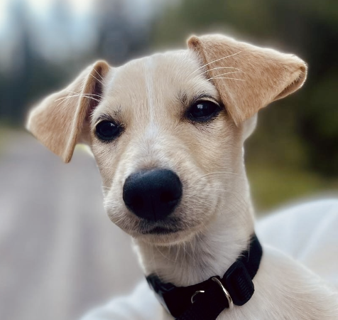
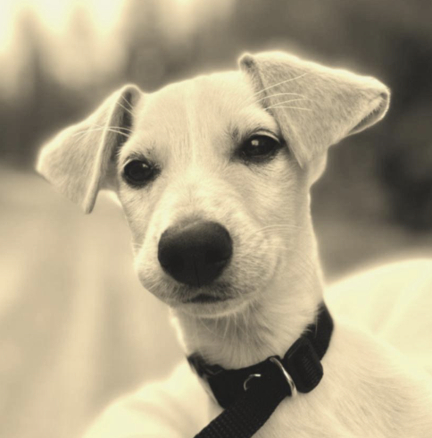

# Image-Edtor 📷

- ☝️ Add your desired photos that you want to edit in the **images**-folder
- ✌️ Run the image_editor.py file and answer the yes or no questions to specify how you want your images edited
- ✨ Wait for a second while the magic happens and voila! your images have been perfectionated. view them in the **editedImages**-folder

## Example

Here's a photo of my dog before it is edited:

And now after i asked the program to make it look like the picture was taken with an analogue camera from 1980:

### Feel free to try it out yourself!

